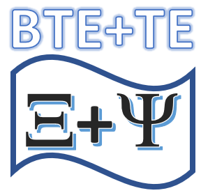
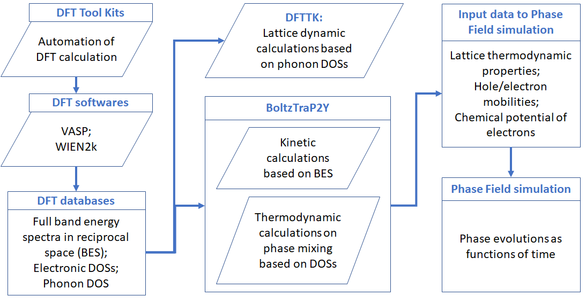

.. BoltzTraP2Y documentation master file, created by
   sphinx-quickstart on Tue Jan 26 18:09:07 2021.
   You can adapt this file completely to your liking, but it should at least
   contain the root `toctree` directive.

|logo| Welcome to BoltzTraP2Y's documentation!
==============================================

**The long term goal of this package is to bridge the data between DFT results, either in its original format or those save in MongoDB database, and the other simulations, for example, the phase-field simualtion of phase transition due to electronic structure change, typically, the metal insulator transition (MIT).**

The above figure shows a schematic demonstration of the technical procedure for the data flow of the package. This package was mainly implemented through the combination of several distinct approaches for accounting the roles of electrons and lattice vibrations:

1. the kinetic properties by means of solving the Boltzmann transport equation. The code was mainly based on forking the [BoltzTraP2](https://gitlab.com/sousaw/BoltzTraP2) by @georg.madsen et al. The major changes include the separation of the electron and hole contributions, in addition to technical improvements on the calculations of the chemical potential of electrons which makes it more efficient for calculation at low temperature that requires extremely refined meshes on electron energy.

2. the thermodynamic properties of electrons involving the mixing between two phases per our recent observations that certain eletron transfer related quantities, including:

- the Seebeck coefficient - [First-principles thermodynamic theory of Seebeck coefficients](https://doi.org/10.1103/PhysRevB.98.224101); and
- the Lorenz number - [Lorenz Number and Electronic Thermoelectric Figure of Merit: Thermodynamics and Direct DFT Calculations](https://arxiv.org/abs/2010.00664)

*which were thought to be dependent on the scattering mechanism and therefore can only be calcullated through the kinetic manner such as the Boltzmann transport equation, are in fact thermodynamic parameters and therefore can be predicted solely based on the electron density of states*.

3. Our development for a package for the automation of first-principles calculations of thermodynamic properties of materials at finite temperature employing the quasi-hamonic phonon approach, as given in a separate documentaton (www.dfttk.org)

For more details, see the section :ref:`Penn State's work`.

.. toctree::
   :maxdepth: 2
   :caption: Contents:

   README.md
   Theory.rst
   Installation.rst
   JupyterNotebook.rst
   BoltzTraP2.md
   dosmix.rst
   psuwork.rst
   CHANGES.rst
   Acknowledgements.rst

Indices and tables
==================

* :ref:`genindex`
* :ref:`modindex`
* :ref:`search`
